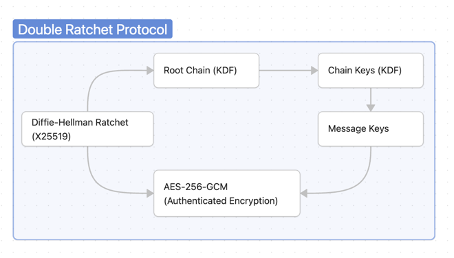

# Double Ratchet + AES Implementation

A pure Java implementation of the Double Ratchet Algorithm with AES-256-GCM encryption, based on the Signal Protocol specification. This project demonstrates end-to-end encryption with forward secrecy and break-in recovery capabilities.

## Table of Contents
- [Overview](#overview)
- [Architecture](#architecture)
- [Installation & Usage](#installation--usage)
- [How It Works](#how-it-works)
- [Security Properties](#security-properties)
- [Project Structure](#project-structure)
- [Technical Details](#technical-details)
- [References](#references)

## Overview

The Double Ratchet Algorithm is a key management protocol used in popular end-to-end encrypted messaging applications like Signal, WhatsApp, and Facebook Messenger. This implementation provides:

- **End-to-end encryption**: Messages are encrypted on the sender's device and only decrypted on the recipient's device
- **Forward secrecy**: Compromise of current keys doesn't reveal past messages
- **Break-in recovery**: After a key compromise, security is restored with future message exchanges
- **Out-of-order message handling**: Messages can arrive out of sequence and still be decrypted

## Architecture

The implementation consists of four main components:

### 1. Cryptographic Primitives (`crypto/`)
- **AESCipher**: AES-256-GCM encryption/decryption with authenticated data
- **DHKeyPair**: X25519 key pair generation and Diffie-Hellman operations
- **HKDF**: Key derivation for root keys and chain keys
- **CryptoUtils**: Helper functions for random bytes, hex encoding, and constant-time comparisons

### 2. Message Format (`message/`)
- **Header**: Contains DH public key and message counters (40 bytes)
- **Message**: Complete encrypted message with header and ciphertext

### 3. Ratchet Logic (`ratchet/`)
- **DoubleRatchet**: Main protocol orchestrator
- **DHRatchet**: Diffie-Hellman ratchet for key agreement
- **SymmetricRatchet**: KDF chain for deriving message keys
- **RatchetState**: Session state management

### 4. Demo Application (`Main.java`)
Demonstrates a complete conversation with out-of-order message delivery.

## Installation & Usage

### Prerequisites
- Java 16+ (for record types)
- No external dependencies required

### Compilation

```bash
# Using the system's Java compiler
javac -d out crypto/*.java message/*.java ratchet/*.java Main.java

# Or specify a specific Java version (e.g., OpenJDK 25)
/path/to/jdk/bin/javac -d out crypto/*.java message/*.java ratchet/*.java Main.java
```

### Running the Demo

```bash
# Using the system's Java runtime
java -cp out doubleratchet.Main

# Or specify a specific Java version
/path/to/jdk/bin/java -cp out doubleratchet.Main
```

### Expected Output

```
=== Double Ratchet Demo ===
1. Simulating initial key exchange...
   Bhuvana's prekey: 828fe20ed7ddd414...
   Shared secret established: 08ca3d4e27b65863...

2. Initializing ratchet sessions...
   Aryan initialized
   Bhuvana initialized

3. Exchanging messages...
   [Messages exchanged successfully]

4. Testing out-of-order delivery...
   [Out-of-order messages handled correctly]

=== Demo Complete ===
```

## How It Works

### Initial Key Exchange

1. **Bhuvana** (responder) publishes a long-term prekey
2. **Aryan** (initiator) generates an ephemeral key and performs DH with Bhuvana's prekey
3. Both parties derive a shared secret using X3DH (Extended Triple Diffie-Hellman)

### Message Exchange Flow

```
Aryan                                    Bhuvana
  |                                         |
  |--- Msg1 (with DH public key) --------->|
  |                                         |  (Performs DH ratchet)
  |                                         |  (Derives receiving chain)
  |<------- Msg2 (new DH public key) ------|
  |                                         |
  | (Performs DH ratchet)                  |
  | (Derives new sending/receiving chains) |
  |                                         |
  |--- Msg3 (new DH public key) --------->|
```

### Key Derivation

Each message uses a unique encryption key derived through:

1. **Root Key**: Updated with each DH ratchet step
2. **Chain Keys**: Separate sending and receiving chains
3. **Message Keys**: Derived from chain keys, used once then deleted

```
Root Key + DH Output → New Root Key + Chain Key
Chain Key → Next Chain Key + Message Key
```

## Security Properties

### Forward Secrecy
- Message keys are deleted immediately after use
- Compromising current keys doesn't reveal past messages
- Each message uses a unique, ephemeral key

### Break-in Recovery (Post-Compromise Security)
- DH ratchet generates new key pairs with each exchange
- After a compromise, new DH agreement provides fresh randomness
- Security is restored within a few message exchanges

### Authentication
- AES-GCM provides authenticated encryption
- Message headers are authenticated as additional data
- Prevents tampering and forgery attacks

### Out-of-Order Delivery
- Skipped message keys are stored (up to 1000 messages)
- Messages can arrive in any order and still decrypt
- Protects against replay attacks with message numbers

## Project Structure

```
Double Ratchet and AES/
├── crypto/
│   ├── AESCipher.java        # AES-256-GCM encryption
│   ├── DHKeyPair.java         # X25519 key operations
│   ├── HKDF.java              # Key derivation
│   └── CryptoUtils.java       # Utility functions
├── message/
│   ├── Header.java            # Message header format
│   └── Message.java           # Complete message structure
├── ratchet/
│   ├── DoubleRatchet.java     # Main protocol
│   ├── DHRatchet.java         # DH ratchet logic
│   ├── SymmetricRatchet.java  # Symmetric ratchet
│   └── RatchetState.java      # Session state
├── Main.java                  # Demo application
└── README.md
```

## Technical Details


### Cryptographic Parameters
- **Key Size**: 256 bits (32 bytes)
- **Nonce Size**: 96 bits (12 bytes) for GCM
- **Auth Tag Size**: 128 bits (16 bytes)
- **DH Curve**: Curve25519 (X25519)
- **Hash Function**: SHA-256 for HKDF

### Message Header Format (40 bytes)
```
+------------------+-----+-----+
| DH Public Key    | PCL | MN  |
| (32 bytes)       | (4) | (4) |
+------------------+-----+-----+

PCL = Previous Chain Length
MN  = Message Number
```

### Encrypted Message Format
```
+-------------+--------+-------------+
| Header Len  | Header | Ciphertext  |
| (4 bytes)   | (var)  | (var)       |
+-------------+--------+-------------+
```

### Ciphertext Format (AES-GCM)
```
+-------+------------+----------+
| Nonce | Encrypted  | Auth Tag |
| (12)  | Data (var) | (16)     |
+-------+------------+----------+
```

## Limitations & Educational Use

This implementation is designed for **educational purposes** to demonstrate the Double Ratchet Algorithm. For production use, consider:

- Using established libraries like [libsignal](https://github.com/signalapp/libsignal)
- Implementing proper key storage and session management
- Adding identity key verification (X3DH protocol)
- Handling network layer and message ordering
- Implementing proper error handling and logging
- Security auditing and penetration testing

## References

- [Signal Double Ratchet Specification](https://signal.org/docs/specifications/doubleratchet/)
- [RFC 5869 - HKDF (HMAC-based Key Derivation Function)](https://tools.ietf.org/html/rfc5869)
- [RFC 7748 - Elliptic Curves for Security (X25519)](https://tools.ietf.org/html/rfc7748)
- [RFC 5116 - AES-GCM Authenticated Encryption](https://tools.ietf.org/html/rfc5116)
- [The Double Ratchet Algorithm - Trevor Perrin & Moxie Marlinspike](https://signal.org/docs/specifications/doubleratchet/doubleratchet.pdf)

## License

This project is provided as-is for educational purposes.

## Contributing

This is an educational implementation. Feel free to fork and modify for learning purposes.

---